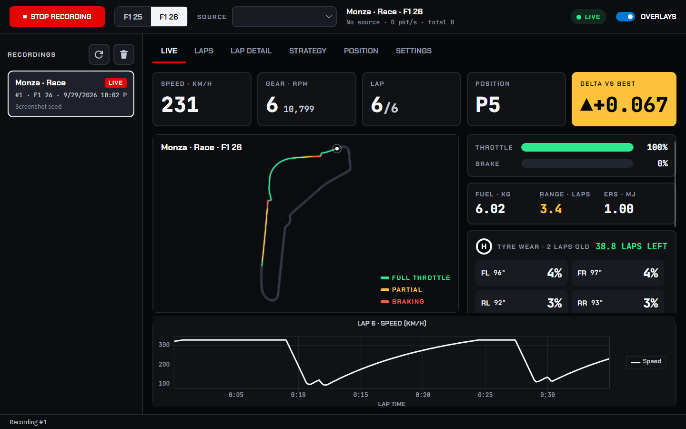
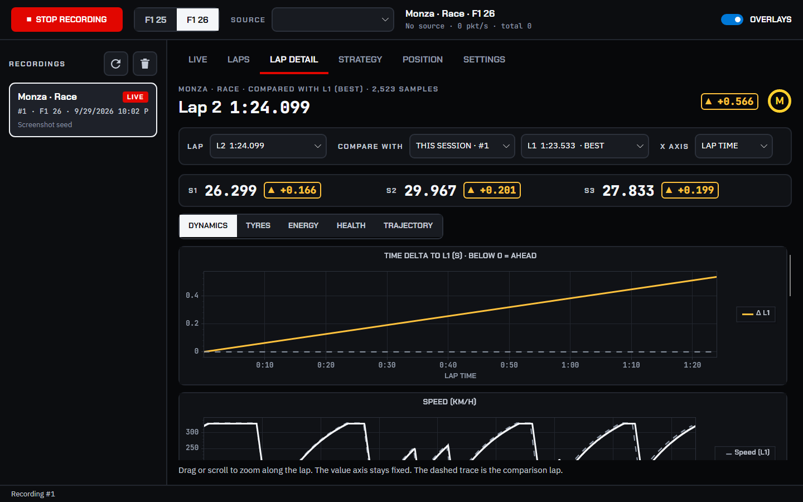
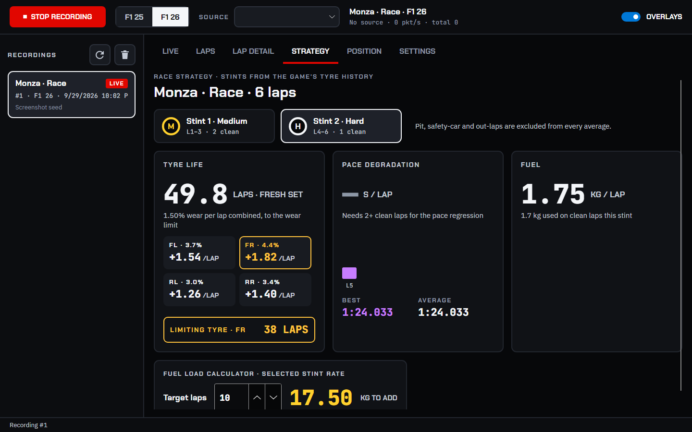
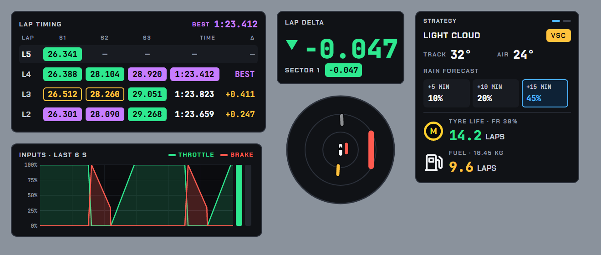
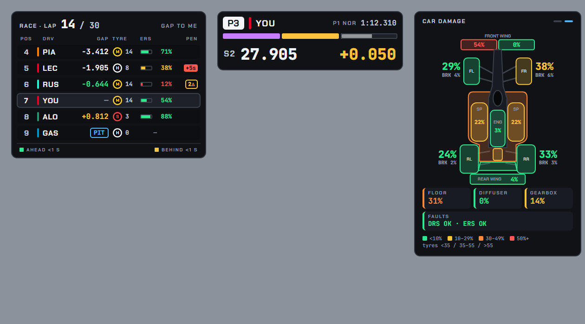

# F1 Telemetry (cross-platform)

Desktop telemetry app for **EA SPORTS F1 25**. It has two telemetry modes: **F1 25** (UDP format `2025`) and **F1 26** (the 2026 Season Pack, UDP format `2026`). It records sessions, calculates strategy (tyre wear, fuel, pace degradation), plots lap telemetry, draws circuit maps, and shows click-through HUD overlays over the game.

It is a rewrite of the Electron + React + DuckDB app on **.NET 10 + Avalonia 12**, and runs on Windows, macOS and Linux.

## Stack

| Concern | Choice | Why |
|---|---|---|
| Runtime | .NET 10 (C# 14) | One language from byte parsing to UI; fast, AOT-capable, first-class on Win/macOS/Linux |
| UI | Avalonia 12 + CommunityToolkit.Mvvm | Native cross-platform rendering (Skia), multi-window, transparent/topmost windows for overlays |
| Charts | ScottPlot 5 | Handles 10k+ point traces per series smoothly (Recharts struggled) |
| Track map / radar | Custom Avalonia `Control`s | Full control, zoom/pan, thousands of segments per frame |
| Storage | DuckDB (DuckDB.NET) | Columnar; per-lap aggregates for stint analytics are single queries |
| Global hotkeys | SharpHook (libuiohook) | Works while the game has focus, on all three desktop OSes |
| Tests | xUnit v3 + Microsoft Testing Platform | |

## Architecture

```
            ┌──────────────┐  ┌──────────────┐  ┌──────────────────┐
 sources    │ UDP :20777   │  │ .f1rec replay│  │ Simulator (demo) │
            └──────┬───────┘  └──────┬───────┘  └────────┬─────────┘
                   └────────── IPacketSource ────────────┘
                                   │ raw datagrams (optionally teed to .f1rec)
                          TelemetryPipeline  (dedicated thread)
                                   │
                     PacketParser  │  exact size check per format (2025 / 2026)
                                   ▼
                         SessionEngine  (pure state machine, no I/O)
      lap types · fuel/tyre consumption · sector deltas · radar · strategy
          │ events                                   │ events
          ▼                                          ▼
 RecordingCoordinator ── ITelemetryStore       LiveDataHub (→ UI thread, ≤ 20 Hz)
 (auto-split, formation-lap and                 │
  flashback handling, lap upserts)              ├─ HUD overlays (7 windows)
          │                                     └─ Live dashboard
          ▼
 DuckDbTelemetryStore (single writer queue, batched appender)
          │
 SessionAnalysisService → LapClassifier + StintAnalyzer → Laps / Strategy / Position / Lap detail views
```

### Projects

| Project | Responsibility | Depends on |
|---|---|---|
| `F1Telemetry.Protocol` | Zero-dependency UDP parser. `FormatLayout` holds every difference between the 2025 and 2026 formats | – |
| `F1Telemetry.Core` | Domain models, `SessionEngine`, strategy calculators, `LapClassifier`, `StintAnalyzer`, `RecordingCoordinator`, track maps (`assets/track_maps/*_coords.json` from the original dashboard, with `.srtt` fallback) | Protocol |
| `F1Telemetry.Simulation` | Spec-exact `PacketWriter` and a physics-lite `SessionSimulator` (speed profile from track curvature, fuel, wear, pit stop, AI cars) | Core |
| `F1Telemetry.Ingest` | Packet sources (UDP, replay, simulator), `.f1rec` capture format, `TelemetryPipeline` | Core, Simulation |
| `F1Telemetry.Storage` | DuckDB schema and migrations, batched writer, analytics queries | Core |
| `F1Telemetry.App` | Avalonia desktop app: dashboard, overlays, hotkeys, settings | all |
| `tools/F1Telemetry.Cli` (`f1tel`) | Capture, replay, simulate, inspect and seed data without the game | Ingest, Storage |
| `tests/F1Telemetry.Tests` | Protocol round-trips for both formats, analytics, end-to-end simulator → DuckDB | all |

### Telemetry modes: F1 25 and F1 26

Pick the mode with the **F1 25 / F1 26** switch in the toolbar. It must match the in-game **Settings → Telemetry → UDP Format** option. The pipeline processes only packets of the selected mode (checked against `m_packetFormat` in every header). If the game sends the other format, those packets are dropped and a banner tells you to switch. The demo simulator produces whichever format is selected. The mode is saved in the settings; for scripting, use `--mode f1-25|f1-26`.

The layout differences between the two formats are handled in `FormatLayout`:

- 24 car slots instead of 22.
- Motion g-forces are quantised `int16 / 1000`, so the slot is 54 bytes instead of 60.
- `engineTemperature` in car telemetry is `u8` instead of `u16`, so the slot is 59 bytes instead of 60.
- Car status gains `ersHarvestLimitPerLap`, so the slot is 59 bytes instead of 55.
- The session packet gains active-aero zones, DRS zones and assist flags (753 → 926 bytes).
- New packet 16, **CarTelemetry2**: active aero mode and overtake mode. These are recorded as `active_aero_mode` and `overtake_active`.

Packets whose length doesn't match their format are rejected and counted, never misread. The Live view shows the count.

## Running

Requires the .NET 10 SDK.

```bash
dotnet run --project src/F1Telemetry.App
```

- **With the game:** enable UDP telemetry in F1 25 (port 20777, send rate 60 Hz). For consoles, set the IP to the PC/Mac running this app.
- **Without the game:** pick *Demo (simulator)* in the Source dropdown, or run:

```bash
dotnet run --project src/F1Telemetry.App -- --mode f1-26 --source demo --record
```

Other switches: `--mode f1-25|f1-26`, `--source udp|demo|replay=<file>`, `--record`, `--tab live|laps|lapdetail|strategy|position|settings`, `--select-latest`, `--lap <n>`, `--preview-overlays` (with `--tab settings`), and `--exit-after <s>` for smoke tests.

Data is stored in `%LOCALAPPDATA%\F1Telemetry` on Windows, `~/Library/Application Support/F1Telemetry` on macOS and `~/.local/share/F1Telemetry` on Linux. Override it with `F1TELEMETRY_DATA_DIR`.

### Developer CLI

```bash
dotnet run --project tools/F1Telemetry.Cli -- simulate --format 2026 --laps 5 --pit 2 --track Silverstone --speed 4   # stream to the app over UDP
dotnet run --project tools/F1Telemetry.Cli -- record --out race.f1rec                                             # capture the real game
dotnet run --project tools/F1Telemetry.Cli -- replay race.f1rec --speed 2                                         # replay it to the app
dotnet run --project tools/F1Telemetry.Cli -- inspect race.f1rec                                                  # packet/format breakdown
dotnet run --project tools/F1Telemetry.Cli -- seed --db test.duckdb --laps 8 --track Spa                          # offline database seeding
```

### Tests

```bash
dotnet test
```

### Screenshots (offscreen)

`tools/F1Telemetry.Screenshots` renders the real main window tabs and HUD overlays with Avalonia.Headless and Skia. It seeds a simulated race into a temporary database and saves PNGs; no windows appear.

```bash
dotnet run --project tools/F1Telemetry.Screenshots -- docs/screenshots
```

### Packaging

Windows single-file exe (no .NET install needed). Output goes to `publish/win-x64/`: `F1Telemetry.exe` plus the `fonts/`, `track_maps/` and `tracks/` folders, which must stay next to it.

```bash
dotnet publish src/F1Telemetry.App -c Release -r win-x64 --self-contained -p:PublishSingleFile=true -p:IncludeNativeLibrariesForSelfExtract=true -p:DebugType=none -o publish/win-x64
```

Other platforms:

```bash
dotnet publish src/F1Telemetry.App -c Release -r osx-arm64 --self-contained
dotnet publish src/F1Telemetry.App -c Release -r linux-x64 --self-contained
```

## Design system

The UI implements the "F1 Telemetry Design Template": a dark, high-contrast race HUD that stays readable at a glance and when seen at an angle.

- **Tokens:** `src/F1Telemetry.App/Theme/Tokens.axaml` holds colours, fonts and radii. `ViewModels/Palette.cs` mirrors the status colours for code. On the panel background, live values reach 17.3:1 contrast, secondary text 11.4:1, labels 6.3:1 and every status colour at least 6:1.
- **Type:** JetBrains Mono for every number, Chakra Petch for labels and headings, IBM Plex Sans for body text. All three are embedded (`Assets/Fonts`, SIL OFL). Numbers are 18 px or larger, and each overlay has one headline number of 56 px or larger.
- **Status is never colour alone:** filled purple = session best, filled green = faster, amber outline = slower, filled red = warning. Deltas carry ▲/▼ and compounds carry a letter (`CompoundBadge`). The shared `Chip` model and template (`App.axaml`) render the same way on overlays, the laps table and lap detail.
- **Controls:** `Theme/Controls.axaml` defines the primary and secondary buttons, the segmented mode toggle, section and segment tabs, card lists and text roles (`label`, `h1`, `data-xl`…`data-s`). Strokes are 2 px or thicker and targets 44 px or larger.
- **Charts and map:** panel background, JetBrains Mono ticks, 3 px traces and a dashed grey best-lap reference. The map draws the tarmac at its true width (at least 6 px) between 1 px track limits, with a thin 2.5 px green/amber/red input ribbon, a thin grey comparison lap and a small car marker. Zoom (up to 60×) moves the points apart but keeps every line's on-screen width, so the lines of different laps separate instead of growing fatter.

| Live | Lap detail | Strategy |
|---|---|---|
|  |  |  |





## Overlays

There are seven HUD windows: **lap timing**, **lap/sector delta**, **proximity radar**, **conditions & strategy**, **input trace**, **sector box** and **timing tower**. Each can be set to *Always*, *Session* (only while recording) or *Never*. The last two, plus the damage page, are meant to replace the game's own HUD.

The **sector box** (top right by default) works like the TV qualifying graphic. It shows your position, team colour and the reference lap, then three colour-only sector bars: purple = fastest of anyone this session, green = your personal best, yellow = slower. The live sector fills as you drive through it, using the session's sector boundaries. Below the bars is the lap time. For 4 s after each split, that sector's time replaces it, in the same large type, with the cumulative gap to the reference lap at that split in coloured text (green ahead, amber behind). The reference is the session's fastest lap (P1) or your personal best, chosen in Settings. Colours and gaps are fixed when you cross the split. A finished lap is held for 4 s, with the lap time filled in its colour and the lap gap beside it (purple when it beats the session best). An invalid lap turns grey with a red strike-through.

The **timing tower** (top left) shows you plus the 3 cars ahead and 2 behind, shifting at the front and back of the field. Each row has the driver code and team colour, the gap, tyre compound and age, battery charge (`ersStoreEnergy` against 4 MJ) and time penalties or track-limit warnings. In races the gap is either the *gap to me* (default, from `deltaToRaceLeader`) or the *interval* to the car ahead, chosen in Settings. Close cars are highlighted: green for the car ahead (or you) within 1 s, amber for a car within 1 s behind you. In qualifying and practice the gap compares best laps, and a red line marks the Q1/Q2 elimination cut-off. Names and teams come from the Participants packet. In 2026 its driver, network and team ids are 16-bit, so each car takes 60 bytes instead of 57. Online players with restricted telemetry show "—" for battery charge.

The **conditions & strategy** overlay has a second page: the car from above with damage per part (front wing L/R, rear wing, sidepods, engine, floor, diffuser, gearbox). It also shows tyre wear, brake damage and DRS/ERS faults. Parts are banded <10 % green, 10–29 % amber, 30–49 % orange, 50 %+ red; tyres use the strategy page's 35 % / 55 % thresholds. The **Strategy / damage page** hotkey (default <kbd>Ctrl</kbd>+<kbd>Alt</kbd>+<kbd>D</kbd>) switches pages. So does a wheel or pad button: bind a button to one of the game's **UDP Action 1–12** controls and pick that action in Settings. The game reports the press in its `BUTN` event, so this works with any wheel, on every OS, without a keyboard hook. When the car takes new bodywork, gearbox or engine damage, or gets a new fault, the overlay shows the damage page for a few seconds (8 s by default, adjustable, can be switched off) and then goes back. Tyre wear, tyre and brake damage, power-unit wear, and damage that goes down after a flashback or repair never trigger it.

The **input trace** plots throttle and brake over the last few seconds (1–30 s, 6 by default) on a 0–100 % scale, with live pedal bars. It is built for latency. The engine raises an allocation-free `InputsCaptured` event for every car-telemetry packet on the ingest thread, straight into a lock-guarded ring buffer (`InputHistory`). The overlay control reads that buffer and redraws on every display frame (`RequestAnimationFrame`), bypassing bindings and the 20 Hz UI tick. Samples sit on the game clock and are mapped to the local clock through the lowest observed arrival latency, so a 60 Hz feed scrolls smoothly on a high-refresh display. When packets stop, the trace freezes and the frame loop idles.

Switch on **PREVIEW OVERLAYS** at the top of the Settings tab to show every overlay with sample data. Overlays can then be **dragged into place**, snapped to a preset, **resized** (50–250 %) and faded (**opacity** 20–100 %), per overlay. While dragged, an overlay is **magnetic to the screen's centre lines**: its centre snaps onto the vertical and horizontal centre (within 16 px) and a blue guide shows while snapped. On Windows this happens in `WM_MOVING` during the native drag; elsewhere the overlay is moved by its own pointer drag with the same snapping (`CentreSnap`). The preview bar never scrolls and always stays usable: an overlay dragged over it gets a see-through, click-through hole (outlined in red) where it covers the bar. On Windows the hole answers `WM_NCHITTEST` with `HTTRANSPARENT`, which hands the click to the main window underneath (same UI thread); on X11 it is cut out of the input shape. macOS can only ignore the mouse for a whole window, so there an overlay dropped on the bar is moved just below it instead. Leaving the Settings tab ends the preview and clears the sample data, so the delta pop-up stays hidden until your first real sector split. The toggle hotkey hides or shows all of them.

| OS | Click-through | Notes |
|---|---|---|
| Windows | `WS_EX_LAYERED \| WS_EX_TRANSPARENT \| WS_EX_NOACTIVATE` | Use borderless-windowed mode; no desktop window can draw over exclusive full-screen |
| macOS | `NSWindow.ignoresMouseEvents` + screen-saver level | Global hotkeys need the Accessibility permission |
| Linux (X11) | Empty XShape input region | Wayland does not allow global overlays or hotkeys |

## Ported functionality and changes

**Kept:** recording with an auto-split on session change, the formation-lap exclusion, live lap classification (PIT > SC > VSC > REGULAR), per-compound fuel and tyre averages with tyre-change detection, laps-remaining to a 75 % wear limit, and the stint post-mortem (wear rates, limiting tyre, lifespan, fuel, linear-regression pace degradation, fuel calculator). The lap-detail chart groups are unchanged, and so are the track maps (the same `track_maps` coordinate files) with input colouring and reference lap, the position history, the overlays with visibility modes, and the global hotkeys.

**Changed:**
- Live data is pushed to the UI instead of the dashboard polling DuckDB 5× every 500 ms.
- Lap classification now lives in one place; it was duplicated in two files.
- Stints are split using the game's tyre-stint history, so a medium → medium stop is detected.
- Packets with session UID 0 (sent while the game leaves a session for the menus) are ignored. They used to look like a session change and back, which auto-split the recording into an extra, empty one.
- Lap charts plot against elapsed lap time (m:ss) by default, or against lap distance (X AXIS picker in Lap detail). The position chart uses session time. Dragging and wheel-zooming only move along the x axis (the value axis is locked), and the view stays within the recorded lap.
- Lap detail shows the S1/S2/S3 split as a strip above full-width chart tabs; the track map has its own **TRAJECTORY** tab.
- Lap detail compares the opened lap with **any lap**: another lap of the same session or a lap from any other recording on the same track (defaults to the session best). The comparison adds a dashed reference trace, a running time-delta chart and sector deltas.
- All SQL is parameterized.
- Samples are appended in batches every 250 ms instead of flushed row by row.
- Settings live in one JSON file instead of both the database and a JSON file.
- Raw `.f1rec` capture/replay and the built-in simulator replace the mock-data generator.
- The track map fits the recorded trajectory when a track has no outline file.
- **Fixed the old parser:** ERS store energy was read from `enginePowerICE`'s offset, and the F1 24 header offsets were wrong.

## Next steps

- Driver names on the radar.
- Installer and auto-update (e.g. Velopack), plus CI builds for all three OSes.
- Synchronised cursor/zoom across lap charts.
- Checking click-through overlays on real macOS and X11 machines (only Windows has been run so far).
